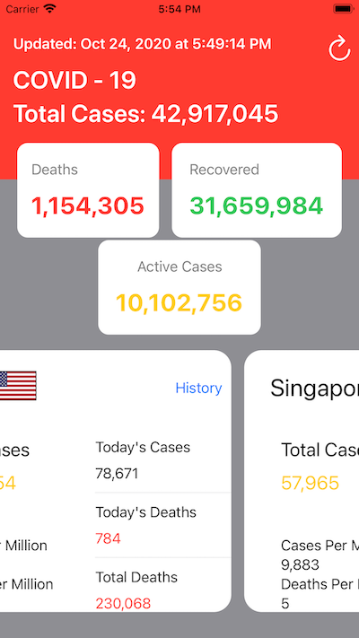
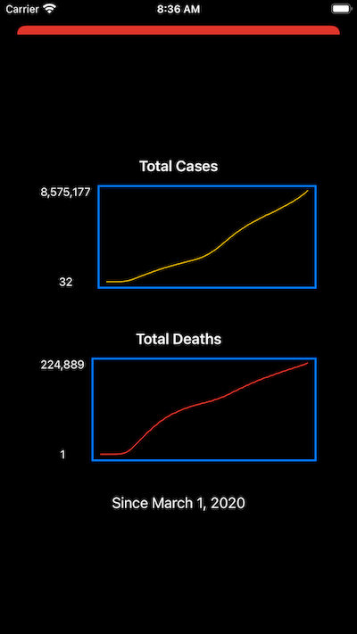

# COVID

COVID is an iOS app written with SwiftUI. It tracks the current worldwide status of the COVID-19 pandemic. The idea and UI were mostly taken from a Kavsoft video. It also pointed me to the API and I added some additional info and a couple more countries.

Added a history Sheet that shows graphs of the country's total cases and deaths since the virus started spreading worldwide.

## License

COVID is licensed under the Unlicense. See the LICENSE file for more information, but basically this is sample code and you can do whatever you want with it.
